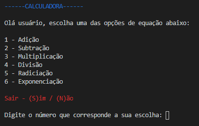
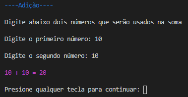
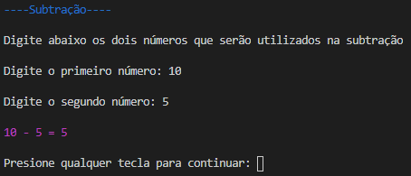
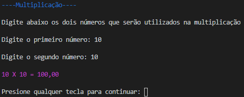
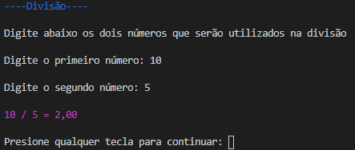
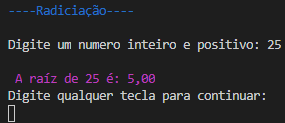
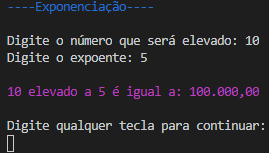

# Calculadora
Atividade para a Etec AB

## Funcionalidade

-Realiza as quatro operações básicas da matemática
-Realiza radiciação
-Realiza exponenciação

## _screenshots_

-Tela inicial:

-Tela de adição:

-Tela de subtração:

-Tela de multiplicação:

-Tela de divisão:

-Tela de radiciação:

-Tela de exponenciação:

## Download

[Download do programa](https://github.com/Maycon-15/Calculadora/raw/main/Distribui%C3%A7%C3%A3o/calculadora.zip).

## Créditos

Feito por um estudante da [Etec Adolpho Berezin](htpp://eteab.com.br). 